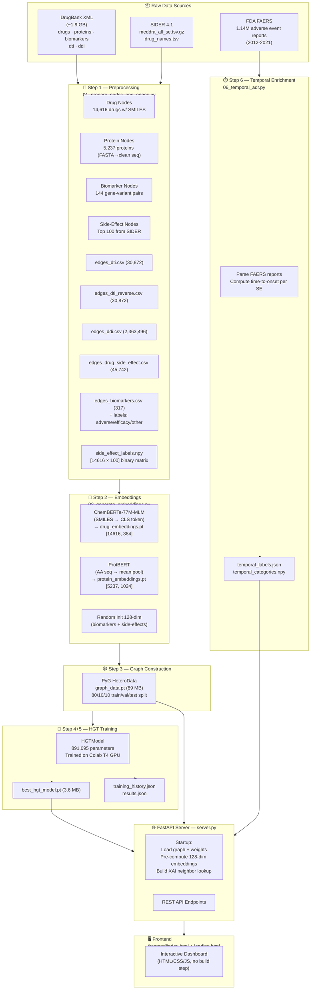
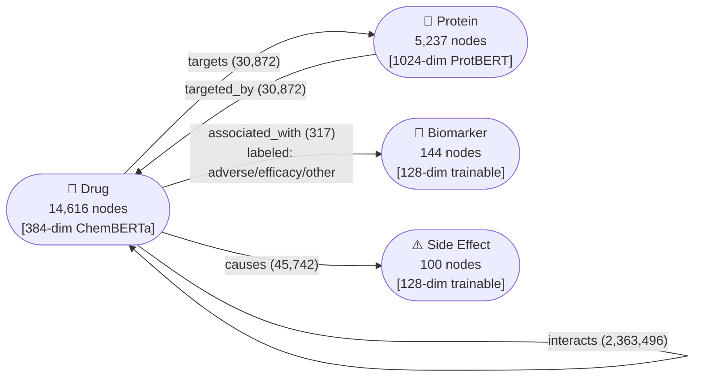
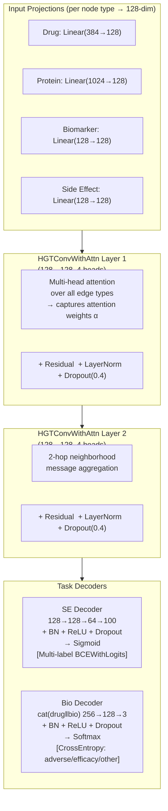
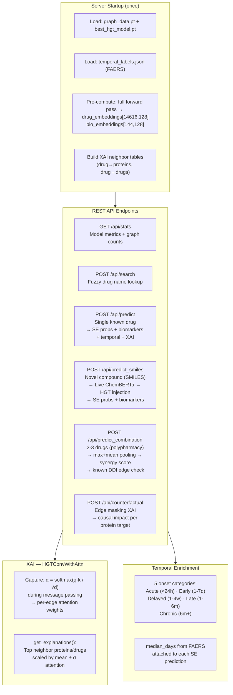
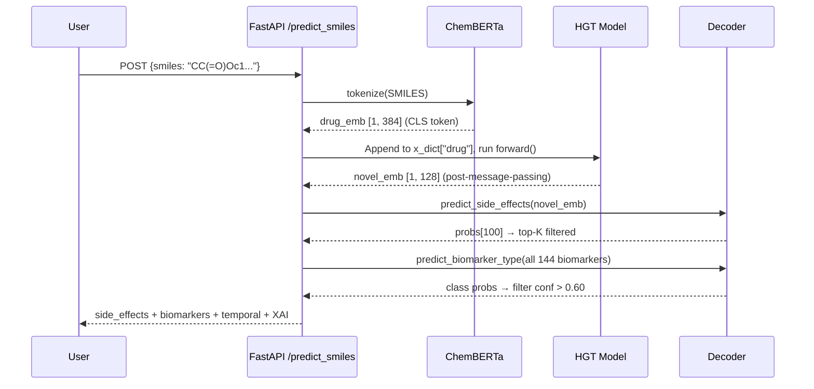

# 🏥 MedWatchPro — System Architecture

> AI-Powered Drug Safety Intelligence using Heterogeneous Graph Transformers
> **AUC-ROC: 0.904 · Biomarker Acc: 90.6% · 891K params · <50ms inference**

---

## 1. End-to-End Pipeline Overview



---

## 2. Knowledge Graph Structure



---

## 3. HGT Model Architecture



**Combined loss**: `L = 1.0 × L_SE + 2.0 × L_Bio` — biomarker up-weighted due to sparse data (317 edges).

**Optimizer**: AdamW, lr=1e-3, weight_decay=1e-4, CosineAnnealingLR, gradient clipping (max_norm=1.0), patience=15–20.

---

## 4. Inference & API Layer



---

## 5. Frontend Routes

| Route | File | Description |
|-------|------|-------------|
| `GET /` | [landing.html](file:///d:/medwatchpro/frontend/landing.html) | Marketing landing page with DNA background |
| `GET /app` | [index.html](file:///d:/medwatchpro/frontend/index.html) | Full interactive dashboard |
| `GET /{file_path}` | Static fallback | Serves images/assets from `frontend/` |

**Dashboard tabs (index.html):**
- **Single Drug** — name/ID search → SE risk bars + temporal badges + biomarker cards + XAI explanation cards
- **Novel Compound** — SMILES input → live ChemBERTa → predictions
- **Combination** — 2-3 drug polypharmacy → synergy scores + known DDI warnings

---

## 6. Key Metrics & File Inventory

### Performance

| Task | Metric | Value |
|------|--------|-------|
| Side-Effect Prediction | ROC-AUC | **0.904** |
| Side-Effect Prediction | F1 (threshold 0.5) | 0.227 |
| Biomarker Classification | Accuracy | **90.6%** |
| Biomarker Classification | F1-Score | 0.898 |
| Training | Epochs (early stop) | 94 |
| Inference latency | Pre-embedded drug | **<50 ms** |

### Critical Files

| File | Role | Size |
|------|------|------|
| [data/processed/graph_data.pt](file:///d:/medwatchpro/data/processed/graph_data.pt) | PyG HeteroData object | 89 MB |
| [data/processed/drug_embeddings.pt](file:///d:/medwatchpro/data/processed/drug_embeddings.pt) | ChemBERTa [14616,384] | 22 MB |
| [data/processed/protein_embeddings.pt](file:///d:/medwatchpro/data/processed/protein_embeddings.pt) | ProtBERT [5237,1024] | 21 MB |
| [data/processed/side_effect_labels.npy](file:///d:/medwatchpro/data/processed/side_effect_labels.npy) | Binary label matrix | 5.8 MB |
| [data/processed/temporal_labels.json](file:///d:/medwatchpro/data/processed/temporal_labels.json) | FAERS onset data | 17 KB |
| [models/best_hgt_model.pt](file:///d:/medwatchpro/models/best_hgt_model.pt) | Trained weights | 3.6 MB |
| [models/training_history.json](file:///d:/medwatchpro/models/training_history.json) | Per-epoch metrics | 9.7 KB |
| [server.py](file:///d:/medwatchpro/server.py) | FastAPI app (788 lines) | 32 KB |
| [frontend/index.html](file:///d:/medwatchpro/frontend/index.html) | Dashboard UI | 61 KB |

---

## 7. Novel Compound (SMILES) Flow



---

## 8. Polypharmacy Synergy Scoring

```
Individual:  P(drug_A)[100]  P(drug_B)[100]
             ↓               ↓
             emb_A [128]     emb_B [128]
                    ↓
             max_pool + mean_pool / 2  →  combined_emb [128]
                    ↓
             P(combined)[100]
                    ↓
Synergy[i] = P(combined)[i] - max(P(drug_A)[i], P(drug_B)[i])
             > 0.05 → "interaction_amplified": true
```
